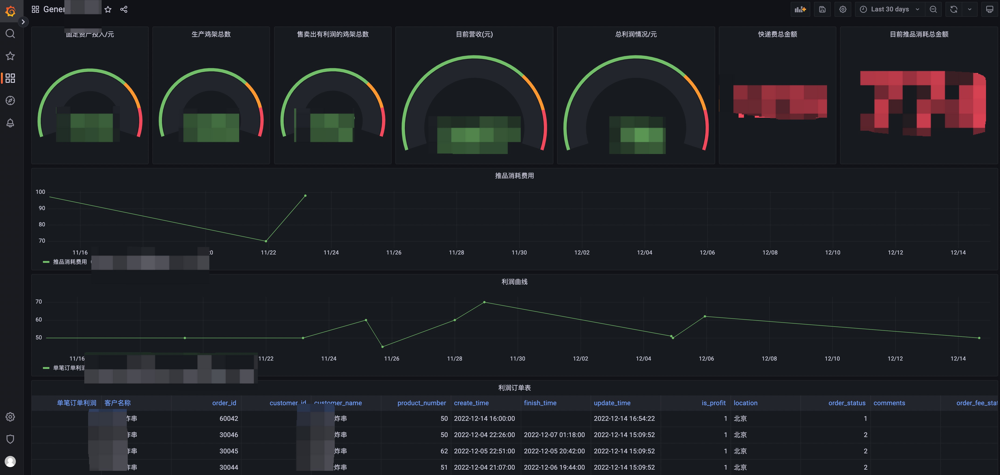

# JCRM(Jan-CRM)

It's a toy create by vue-admin-template(vue) and actix_web(Rust) and sqlx(rust).  

1. Now, you can see the alpha version that show something below, and it was inspired by a `vue-admin-template` project of `vue` which is easy to learn and use.

    

2. For functions, the most important part is how to control and trace cost and profit in daily business. So I also use grafana to access database for calculating the change everyday. Actually, you can record all of things you want by yourself, and I won't share this part.

    

3. I also decided to use TiDB Serverless to store information, which is really Advanced, Secure, stable, pay-as-you-go basis Dbaas. And I recommand you to explore more on that, their website is [tidb cloud](https://docs.pingcap.com/tidbcloud).

    

4. You can run this project as below:

    ```shell
    # create table in database
    cd crm-backend/config/schemas
    jijia-schema-create.sql
    jijia.chicken_source_results-schema.sql
    jijia.chicken_source_weights-schema.sql
    jijia.customer-schema.sql
    jijia.customer_sale_info-schema.sql
    jijia.delivery-schema.sql
    jijia.fixed_costs-schema.sql
    jijia.non_fixed_costs-schema.sql
    jijia.orders-schema.sql
    jijia.users-schema.sql

    # run backend service
    cd crm-backend
    cargo run 

    # run front service
    cd crm-front
    yarn dev
    ```
